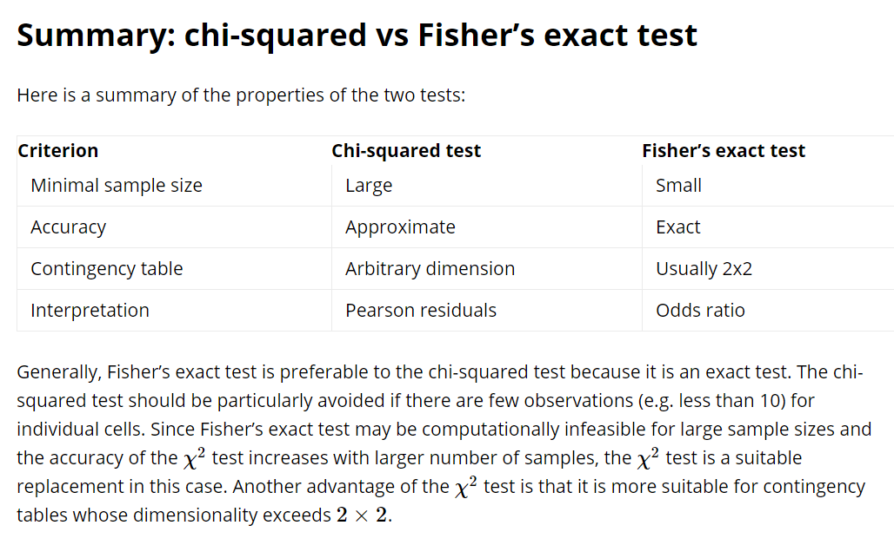

- [Testing Independence: Chi-Squared vs Fisher's Exact Test](https://www.datascienceblog.net/post/statistical_test/contingency_table_tests/)

- [Chi-Square Test and Fisher’s Exact Test in R](https://www.youtube.com/watch?v=POiHEJqmiC0)
